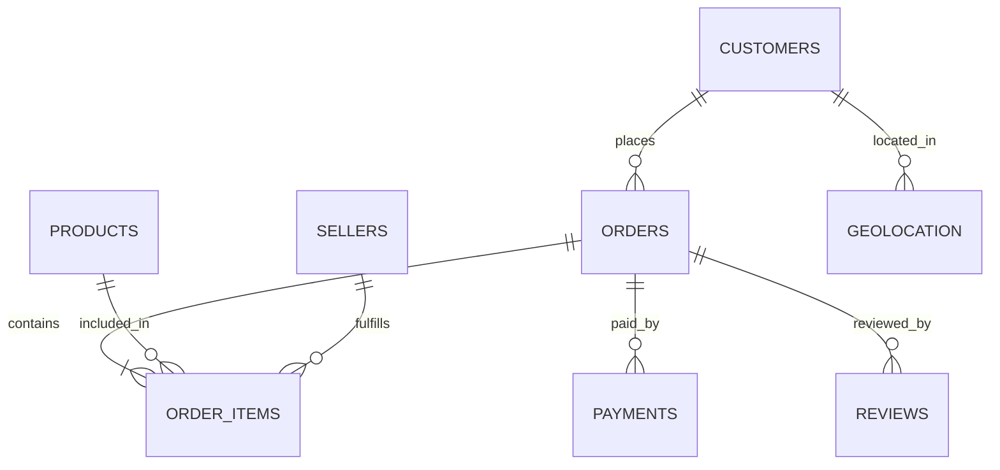

# target-ecommerce-sql-analysis
📊 Target E-commerce SQL Analysis


# 📊 Target E-Commerce Analytics | End-to-End SQL Business Case Study

## 🚀 Project Overview

Target is a globally renowned brand and a prominent retailer in the United States. Target makes itself a preferred shopping destination by offering outstanding value, inspiration, innovation and an exceptional guest experience that no other retailer can deliver.
This particular business case focuses on the operations of Target in Brazil and provides insightful information about 100,000 orders placed between 2016 and 2018. The dataset offers a comprehensive view of various dimensions including the order status, price, payment and freight performance, customer location, product attributes, and customer reviews.
By analysing this extensive dataset, it becomes possible to gain valuable insights into Target's operations in Brazil. The information can shed light on various aspects of the business, such as order processing, pricing strategies, payment and shipping efficiency, customer demographics, product characteristics, and customer satisfaction levels.
Assuming I am a data analyst/ scientist at Target, I have analysed the given dataset to extract valuable insights and provided actionable recommendations.

The analysis was performed on a multi-table relational dataset consisting of customers, orders, products, payments, sellers, and logistics information to uncover operational bottlenecks, growth opportunities, and business optimization strategies.

---

# 🎯 Business Objectives

The project was designed to answer key business questions such as:

* Is the business experiencing sustainable growth?
* Are there seasonal or behavioral purchasing trends?
* Which regions contribute the most revenue and customers?
* How efficient is the delivery and logistics network?
* What payment behaviors do customers prefer?
* Which operational areas require optimization?

---

# 🗂 Dataset Information

The dataset contains transactional e-commerce data across Brazil and includes the following tables:

| Table Name        | Description                            |
| ----------------- | -------------------------------------- |
| `customers.csv`   | Customer demographic and location data |
| `orders.csv`      | Order lifecycle and timestamps         |
| `order_items.csv` | Product-level order information        |
| `payments.csv`    | Payment method and installment details |
| `products.csv`    | Product catalog information            |
| `sellers.csv`     | Seller information                     |
| `reviews.csv`     | Customer review data                   |
| `geolocation.csv` | Geographic mapping data                |

---

# 🧩 Entity Relationship Diagram



---

# ⚙️ Technology Stack

| Technology      | Purpose                             |
| --------------- | ----------------------------------- |
| SQL (BigQuery)  | Data querying and analytics         |
| Google BigQuery | Cloud data warehouse                |
| GitHub          | Version control and project hosting |
| CSV Datasets    | Source data                         |
| Markdown        | Documentation                       |

---

# 🔍 Business Questions, SQL Queries & Insights

# I. Exploratory Data Analysis

## A. Data Types of All Columns in the Customers Table

### SQL Query

```sql
SELECT
    column_name,
    data_type
FROM `ecommerce-459515.target.INFORMATION_SCHEMA.COLUMNS`
WHERE table_name = 'customers';
```

### Insight

Most columns are of STRING type, indicating that the dataset is heavily categorical and identifier-driven.

---

## B. Time Range Between Orders

### SQL Query

```sql
SELECT
    MIN(order_purchase_timestamp) AS first_order,
    MAX(order_purchase_timestamp) AS last_order
FROM `target.orders`;
```

### Insight

The dataset spans from September 2016 to October 2018, providing approximately two years of transactional history.

---

## C. Count of Cities & States Where Orders Were Placed

### SQL Query

```sql
SELECT
    COUNT(DISTINCT customer_city) AS city_count,
    COUNT(DISTINCT customer_state) AS state_count
FROM `target.orders` o
INNER JOIN `target.customers` c
USING(customer_id);
```

### Insight

The platform served customers across:

* 4,119 cities
* 27 states

This indicates extensive geographic penetration across Brazil.

---

# II. Order Trends & Seasonality Analysis

## A. Growth Trend in Orders Over the Years

### SQL Query

```sql
SELECT
    EXTRACT(YEAR FROM order_purchase_timestamp) AS year,
    COUNT(*) AS orders_count
FROM `target.orders`
GROUP BY year
ORDER BY year;
```

### Insight

* Orders grew exponentially between 2016 and 2018.
* Growth exceeded 13,000% from 2016 to 2017.
* Continued positive growth in 2018 indicates sustained customer acquisition.

---

## B. Monthly Seasonality Analysis

### SQL Query

```sql
SELECT
    EXTRACT(YEAR FROM order_purchase_timestamp) AS year,
    EXTRACT(MONTH FROM order_purchase_timestamp) AS month,
    COUNT(*) AS orders_count
FROM `target.orders`
GROUP BY 1,2
ORDER BY 1,2;
```

### Insight

* Peak order activity occurred during January–March.
* February recorded the highest order volume.
* Significant decline observed during August and September.

This suggests strong seasonal purchasing behavior.

---

## C. Time of Day When Customers Place Orders

### SQL Query

```sql
SELECT
    CASE
        WHEN EXTRACT(HOUR FROM order_purchase_timestamp) BETWEEN 0 AND 6 THEN 'Dawn'
        WHEN EXTRACT(HOUR FROM order_purchase_timestamp) BETWEEN 7 AND 12 THEN 'Morning'
        WHEN EXTRACT(HOUR FROM order_purchase_timestamp) BETWEEN 13 AND 18 THEN 'Afternoon'
        WHEN EXTRACT(HOUR FROM order_purchase_timestamp) BETWEEN 19 AND 23 THEN 'Night'
    END AS time_of_day,
    COUNT(*) AS total_orders
FROM `target.orders`
GROUP BY 1
ORDER BY 2 DESC;
```

### Insight

* Afternoon and Night recorded the highest order volume.
* Dawn had the lowest purchasing activity.

This indicates customers prefer shopping after working hours.

---

# III. Regional Performance Analysis

## A. Month-on-Month Orders by State

### SQL Query

```sql
SELECT
    EXTRACT(YEAR FROM order_purchase_timestamp) AS year,
    EXTRACT(MONTH FROM order_purchase_timestamp) AS month,
    customer_state,
    COUNT(*) AS total_orders
FROM `target.orders` o
INNER JOIN `target.customers` c
USING(customer_id)
GROUP BY 1,2,3
ORDER BY 4 DESC;
```

### Insight

* PR and RS demonstrated strong monthly order consistency.
* Some states showed very limited order activity.

This reveals unequal regional demand distribution.

---

## B. Customer Distribution Across States

### SQL Query

```sql
SELECT
    customer_state,
    COUNT(DISTINCT customer_id) AS unique_customers
FROM `target.customers`
GROUP BY customer_state
ORDER BY unique_customers DESC;
```

### Insight

Top customer-contributing states:

1. SP
2. RJ
3. MG

These regions represent the strongest customer markets.

---

# IV. Revenue & Economic Impact Analysis

## A. Percentage Increase in Order Cost (2017–2018)

### SQL Query

```sql
WITH base_1 AS (
    SELECT *
    FROM `target.orders` o
    INNER JOIN `target.payments` p
    USING(order_id)
    WHERE EXTRACT(YEAR FROM order_purchase_timestamp) BETWEEN 2017 AND 2018
    AND EXTRACT(MONTH FROM order_purchase_timestamp) BETWEEN 1 AND 8
),

base_2 AS (
    SELECT
        EXTRACT(YEAR FROM order_purchase_timestamp) AS year,
        ROUND(SUM(payment_value),2) AS total_cost
    FROM base_1
    GROUP BY year
),

base_3 AS (
    SELECT *,
        LEAD(total_cost) OVER(ORDER BY year) AS next_year_cost
    FROM base_2
)

SELECT *,
    (next_year_cost - total_cost)/total_cost * 100 AS percent_increase
FROM base_3;
```

### Insight

Order spending increased by 138.53% between 2017 and 2018.

This indicates substantial growth in consumer purchasing power and platform revenue.

---

## B. Total & Average Order Value by State

### SQL Query

```sql
SELECT
    customer_state,
    ROUND(SUM(price),2) AS total_order_value,
    ROUND(AVG(price),2) AS average_order_value
FROM `target.orders` o
INNER JOIN `target.order_items` oi
USING(order_id)
INNER JOIN `target.customers` c
USING(customer_id)
GROUP BY customer_state
ORDER BY total_order_value DESC;
```

### Insight

* SP generated the highest total revenue.
* AL recorded the highest average order value.

This indicates different purchasing behaviors across states.

---

## C. Total & Average Freight Value by State

### SQL Query

```sql
SELECT
    customer_state,
    ROUND(SUM(freight_value),2) AS total_freight,
    ROUND(AVG(freight_value),2) AS average_freight
FROM `target.orders` o
INNER JOIN `target.order_items` oi
USING(order_id)
INNER JOIN `target.customers` c
USING(customer_id)
GROUP BY customer_state
ORDER BY total_freight DESC;
```

### Insight

* SP had the highest total freight value.
* PB recorded the highest average freight cost.

This highlights regional logistics inefficiencies.

---

# V. Logistics & Delivery Performance Analysis

## A. Delivery Time & Estimated Delivery Difference

### SQL Query

```sql
SELECT
    order_id,
    TIMESTAMP_DIFF(order_delivered_customer_date,
                   order_purchase_timestamp,
                   DAY) AS time_to_deliver,

    TIMESTAMP_DIFF(order_delivered_customer_date,
                   order_estimated_delivery_date,
                   DAY) AS delivery_difference
FROM `target.orders`
WHERE order_status = 'delivered';
```

### Insight

* Some orders were delivered earlier than estimated.
* Many experienced delays.

Delivery performance varies significantly across the platform.

---

## B. Top 5 Highest & Lowest Average Freight States

### SQL Query

```sql
(
SELECT
    customer_state,
    ROUND(AVG(freight_value),2) AS avg_freight
FROM `target.orders`
INNER JOIN `target.order_items`
USING(order_id)
INNER JOIN `target.customers`
USING(customer_id)
GROUP BY customer_state
ORDER BY avg_freight DESC
LIMIT 5
)

UNION ALL

(
SELECT
    customer_state,
    ROUND(AVG(freight_value),2) AS avg_freight
FROM `target.orders`
INNER JOIN `target.order_items`
USING(order_id)
INNER JOIN `target.customers`
USING(customer_id)
GROUP BY customer_state
ORDER BY avg_freight
LIMIT 5
);
```

### Insight

* RR, PB, and RO showed the highest freight costs.
* SP, PR, and MG had the lowest freight costs.

Freight optimization opportunities exist in remote regions.

---

## C. Top 5 Highest & Lowest Average Delivery Time States

### SQL Query

```sql
(
SELECT
    customer_state,
    AVG(TIMESTAMP_DIFF(order_delivered_customer_date,
                       order_purchase_timestamp,
                       DAY)) AS avg_delivery_time
FROM `target.orders`
INNER JOIN `target.order_items`
USING(order_id)
INNER JOIN `target.customers`
USING(customer_id)
GROUP BY customer_state
ORDER BY avg_delivery_time DESC
LIMIT 5
)

UNION ALL

(
SELECT
    customer_state,
    AVG(TIMESTAMP_DIFF(order_delivered_customer_date,
                       order_purchase_timestamp,
                       DAY)) AS avg_delivery_time
FROM `target.orders`
INNER JOIN `target.order_items`
USING(order_id)
INNER JOIN `target.customers`
USING(customer_id)
GROUP BY customer_state
ORDER BY avg_delivery_time
LIMIT 5
);
```

### Insight

* RR, AP, and AM experienced the slowest deliveries.
* SP, PR, and MG had the fastest deliveries.

Infrastructure and geographic location strongly influence delivery efficiency.

---

## D. States Delivering Faster Than Estimated

### SQL Query

```sql
SELECT
    customer_state AS state,

    ROUND(
        SUM(TIMESTAMP_DIFF(order_delivered_customer_date,
                           order_purchase_timestamp,
                           DAY))/COUNT(order_id),2
    ) AS avg_actual_delivery,

    ROUND(
        SUM(TIMESTAMP_DIFF(order_estimated_delivery_date,
                           order_purchase_timestamp,
                           DAY))/COUNT(order_id),2
    ) AS avg_estimated_delivery

FROM `target.orders` o
INNER JOIN `target.customers` c
ON o.customer_id = c.customer_id

WHERE order_status = 'delivered'
GROUP BY customer_state
ORDER BY (avg_actual_delivery - avg_estimated_delivery);
```

### Insight

* PR, MG, PB, PE, and MT delivered significantly faster than estimated.

Improved delivery estimate accuracy can enhance customer trust.

---

# VI. Payment Behavior Analysis

## A. Month-on-Month Orders by Payment Type

### SQL Query

```sql
SELECT
    payment_type,
    EXTRACT(YEAR FROM order_purchase_timestamp) AS year,
    EXTRACT(MONTH FROM order_purchase_timestamp) AS month,
    COUNT(o.order_id) AS total_orders
FROM `target.payments` p
INNER JOIN `target.orders` o
USING(order_id)
GROUP BY payment_type, year, month
ORDER BY year, month;
```

### Insight

* Credit cards dominated customer transactions.
* Payment behavior remained relatively stable over time.

Flexible payment systems contribute to customer convenience.

---

## B. Orders by Payment Installments

### SQL Query

```sql
SELECT
    payment_installments,
    COUNT(DISTINCT order_id) AS total_orders
FROM `target.payments`
WHERE payment_installments >= 1
GROUP BY payment_installments
ORDER BY payment_installments;
```

### Insight

Higher installment usage suggests customers prefer flexible financing options for purchases.

---

# 📈 Core Business Insights

| Area              | Key Insight                                    |
| ----------------- | ---------------------------------------------- |
| Growth            | Rapid expansion between 2016–2018              |
| Customer Behavior | Afternoon & Night are peak order windows       |
| Geography         | SP, RJ, MG dominate customer concentration     |
| Logistics         | Significant regional delivery variation exists |
| Revenue           | Customer spending increased substantially      |
| Payments          | Installments and credit cards dominate         |

---

# 🚀 Strategic Recommendations

## Operations

* Improve logistics in high-delay regions
* Optimize freight routes to reduce shipping costs

## Growth

* Expand marketing campaigns in underpenetrated states
* Increase inventory during high-demand periods

## Customer Experience

* Improve delivery estimate accuracy
* Use fast-delivery regions as a competitive advantage

## Payment Strategy

* Promote installment plans
* Incentivize alternate payment methods

---

# 📂 Repository Structure

```bash
target-ecommerce-sql-analysis/
│
├── data/
├── sql/
├── outputs/
│   └── screenshots/
├── docs/
│   ├── insights.md
│   └── er_diagram.png
└── README.md
```

---

# 🧠 Skills Demonstrated

* Advanced SQL Querying
* Window Functions
* Joins & Aggregations
* Data Cleaning & Exploration
* Business Intelligence
* Logistics Analytics
* Trend Analysis
* Data Modeling
* Analytical Problem Solving

---

# 📌 Conclusion

This project demonstrates how SQL-driven analytics can be leveraged to solve real-world business problems in an e-commerce environment. By integrating customer behavior analysis, revenue trends, logistics evaluation, and payment intelligence, the project showcases a complete analytics workflow aligned with industry-level data analytics and business intelligence practices.

---

# 👤 Author

**Shatabdi Dutta**

SQL | Data Analytics | Business Intelligence
